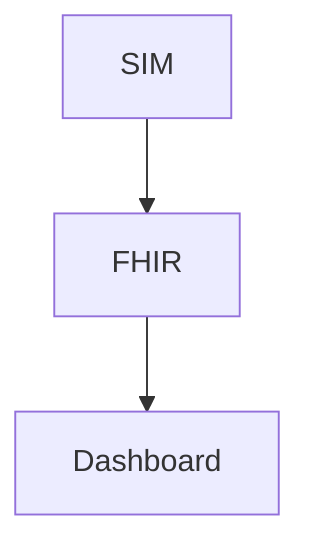

# Compleet 

!!! info "FHIR"

    Observation.effectiveDateTime representeert het klinisch relevante meetmoment.

!!! warning "Breaking change"

    ETL1 mappings moeten aangepast worden.

```mermaid
graph TD
    SIM --> FHIR
    FHIR --> Dashboard
```